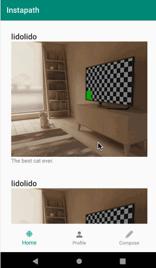

# Project 3 - *Instapath*

**Instapath** is a photo sharing app similar to Instagram but using Parse as its backend.

## User Stories

The following functionality is completed:

- [X] User can view the last 20 posts submitted to "Instagram".
- [X] User can pull to refresh the last 20 posts submitted to "Instagram".
- [X] The user should switch between different tabs - viewing all posts (feed view), capture (camera and photo gallery view) and profile tabs (posts made) using fragments and a Bottom Navigation View. (2 points)

## Video Walkthrough

Here's a walkthrough of implemented user stories:

GIF created with [LiceCap](http://www.cockos.com/licecap/).

## Open-source libraries used

- [Android Async HTTP](https://github.com/codepath/CPAsyncHttpClient) - Simple asynchronous HTTP requests with JSON parsing
- [Glide](https://github.com/bumptech/glide) - Image loading and caching library for Android

